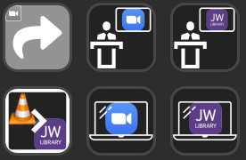
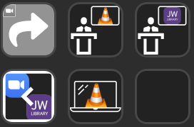

# Combo Dual 1 for 6 buttons devices

## Preview

## Requirements / Dependencies

This profile depends on the following Stream Deck plugins:

* [LostDomain's Stream Deck plugin for Zoom](https://lostdomain.org/stream-deck-plugin-for-zoom/)

On Windows, to deal with the windows management, you will also need:

* an installation of AutoHotKey (to use the .ahk file) or the related .exe (self-sufficient)

On Mac, you will also need:

* (unknown - to be tested)

