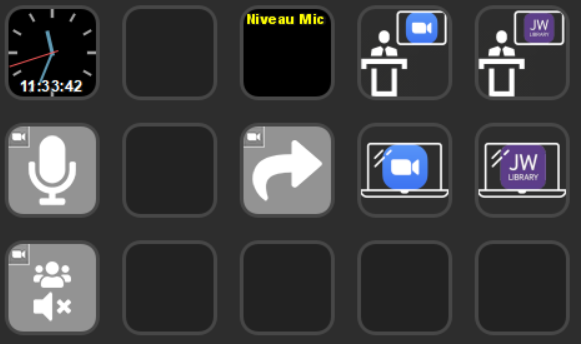

# Combo 1 for 15 buttons devices

This is a crude extension of the [Combo1 profile for 06 buttons ESD](../../06buttons/Combo1/).

## Preview

## Requirements / Dependencies

This profile depends on the following Stream Deck plugins:

* [Bar Raider's Audio Meter](https://github.com/barraider/streamdeck-audiometer)
* [LostDomain's Stream Deck plugin for Zoom](https://lostdomain.org/stream-deck-plugin-for-zoom/)
* [Elgato's Analog Clock](https://github.com/elgatosf/streamdeck-analogclock)

On Windows, to deal with the windows management, you will also need:

* an installation of AutoHotKey (to use the .ahk file) or the related .exe (self-sufficient)

On Mac, you will also need:

* (unknown - to be tested)

